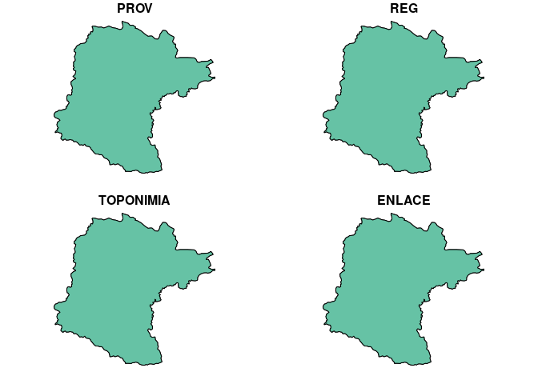
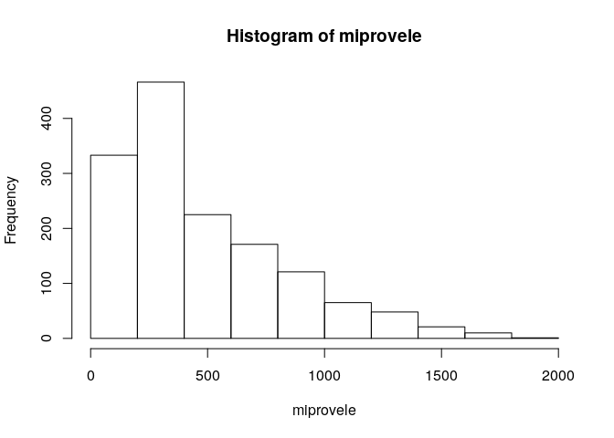

Unidad 1, asignación 2: exportar datos, leer ráster y extraer valores
=====================================================================

Sigo ayudando con `...`. Donde quiera que los veas, deberás sustituirlos por lo que indique el correspondiente mandato.

Dentro de las opciones de `knitr`, en el encabezado de este archivo, es probable que encuentres el argumento `eval = F`. Antes de tejer debes cambiarlo a `eval = T`, para que evalúe los bloques de código según tus cambios.

Provincia asignada
------------------

Toma nota del código de tu provincia asignada aleatoriamente.

``` r
 # abreviatura provaleatoria
 #       acade            11
 #       agrie            09
 #       aleir            10
 #       arqco            16
 #       cindy            12
 #       franc            23
 #       geora            08
 #       hoyod            22
 #       ingan            07
 #       ingdi            19
 #       itac9            15
 #       ivanv            25
 #       lbine            30
 #       leona            24
 #       magda            20
 #       maryj            02
 #       masue            26
 #       mmvol            13
 #       naui2            29
 #       rober            27
 #       wilne            06
 #       yoenn            21
```

Paquetes
--------

-   Carga el paquete `sf` y el paquete `raster`.

``` r
library(sf)
## Linking to GEOS 3.7.1, GDAL 2.4.2, PROJ 5.2.0
library(raster)
## Loading required package: sp
```

Exporta
-------

-   Determina el nombre de la capa provincias con `st_layers` del archivo GeoPackage que se encuentra en la carpeta `data`.

-   Carga la capa de provincias con la función `st_read`, asignándola al objeto `prov`.

-   Genera el objeto `miprov` que sólo contenga tu provincia.

-   Usando la función `st_write`, exporta el objeto `miprov` como GeoPackage a la carpeta `data` con el nombre `miprovexportado.gpkg`.

-   Lee el archivo exportado con la función `st_read` y asígnalo al objeto `miprovexportado`. Dado que sólo tiene una capa, no tienes que especificar el argumento `layer`.

-   Imprime en pantalla el objeto `miprovexportado` (sólo necesitas escribir el nombre del objeto).

``` r
st_layers('data/divisionRD.gpkg')
## Driver: GPKG 
## Available layers:
##      layer_name geometry_type features fields
## 1 PROVCenso2010       Polygon       32      4
## 2  MUNCenso2010       Polygon      155      5
## 3  REGCenso2010       Polygon       10      2
prov <- st_read(dsn = 'data/divisionRD.gpkg', layer = 'PROVCenso2010')
## Reading layer `PROVCenso2010' from data source `/home/masue/unidad-1-asignacion-2-rasters-y-exportar-datos-espaciales-masuero/data/divisionRD.gpkg' using driver `GPKG'
## Simple feature collection with 32 features and 4 fields
## geometry type:  MULTIPOLYGON
## dimension:      XY
## bbox:           xmin: 182215.8 ymin: 1933532 xmax: 571365.3 ymax: 2205216
## epsg (SRID):    32619
## proj4string:    +proj=utm +zone=19 +datum=WGS84 +units=m +no_defs
miprov <- prov[prov$PROV %in% '26', ]
st_write(obj = miprov, dsn = 'data/miprovexportado.gpkg', driver = 'GPKG')
## Updating layer `miprovexportado' to data source `data/miprovexportado.gpkg' using driver `GPKG'
## Updating existing layer miprovexportado
## Writing 1 features with 4 fields and geometry type Multi Polygon.
miprovexportado <- st_read(dsn = 'data/miprovexportado.gpkg')
## Reading layer `miprovexportado' from data source `/home/masue/unidad-1-asignacion-2-rasters-y-exportar-datos-espaciales-masuero/data/miprovexportado.gpkg' using driver `GPKG'
## Simple feature collection with 2 features and 4 fields
## geometry type:  MULTIPOLYGON
## dimension:      XY
## bbox:           xmin: 235278.3 ymin: 2121042 xmax: 282380.8 ymax: 2165555
## epsg (SRID):    32619
## proj4string:    +proj=utm +zone=19 +datum=WGS84 +units=m +no_defs
plot (miprovexportado)
```



Ráster
------

-   Con la función `raster`, carga el modelo digital de elevaciones que se encuentra en la carpeta `data`. Es el único archivo de extensión `.tif` Asígnalo al objeto `mde`

-   Genera un mapa con la función `plot`, usando la paleta de colores `terrain.colors`.

``` r
mde <- raster('data/mde_rd.tif')
plot(mde, col = terrain.colors(n = 255))
```


Extraer valores del ráster
--------------------------

-   Con la función `raster::extract`, extrae los valores de elevación correspondientes a tu provincia. Utiliza `mde` como objeto ráster y `miprov` como capa zonal. Asigna los valores al objeto `miprovele`.

-   Imprime en pantalla el objeto `miprovele` (sólo necesitas escribir el nombre del objeto).

-   Obtén los estadísticos descriptivos básicos (mínimo, primer cuartil, media, mediana, tercer cuartil, máximo) de `miprovele` con la función `summary`.

-   Genera un histograma de `miprovele` usando la función `hist`.

``` r
miprovele <- raster::extract(mde, miprov)[[1]]
miprovele
##    [1]  270.94  273.88   61.35   68.24   81.14  119.97  126.49  240.89
##    [9]  265.57  270.49  235.38   68.19   64.54   74.10   86.82   97.11
##   [17]  112.33  127.52  142.02  149.39  159.82  178.35  196.52  204.49
##   [25]  166.66  153.89  260.05   87.92   78.96   73.30   73.33   92.51
##   [33]   99.06  123.25  133.35  144.99  156.31  172.08  165.48  161.04
##   [41]  154.93  147.21  200.91  256.07  263.47  246.40   87.04   94.39
##   [49]   88.78   77.09   69.71   83.07  104.91  108.85  132.17  144.99
##   [57]  170.05  169.79  159.18  153.61  150.05  144.97  145.80  201.11
##   [65]  223.56  264.85  269.97  311.20  307.85  278.04  314.23  205.69
##   [73]   86.59   96.11   97.63   91.19   81.82   82.45   93.37  107.22
##   [81]  120.47  131.57  147.08  162.72  173.70  169.44  165.33  154.59
##   [89]  165.07  149.81  189.01  186.89  191.64  212.79  231.45  251.44
##   [97]  271.83  298.52  271.32  274.21  188.64   94.82  104.89  103.69
##  [105]   94.32   81.26   95.26   94.06   98.14  107.08  116.49  132.79
##  [113]  162.33  171.79  165.16  162.01  165.63  174.14  148.92  164.49
##  [121]  177.16  185.40  197.01  207.16  216.51  233.75  265.59  271.07
##  [129]  217.99  150.89  111.61  109.40  109.67  104.85  111.85  104.39
##  [137]   89.41   85.63   85.71   93.06   95.22  101.72  116.71  126.18
##  [145]  136.57  160.15  172.43  176.91  184.57  183.40  157.76  156.60
##  [153]  173.10  185.64  193.75  202.44  211.76  229.23  239.94  224.23
##  [161]  191.73  176.16  168.85  130.50  134.12  120.76  110.80  115.94
##  [169]   99.41   90.06   94.05  100.29   97.72  100.83  101.08  108.59
##  [177]  121.07  135.23  151.38  158.28  167.65  188.22  180.28  158.40
##  [185]  170.55  193.68  199.00  210.56  218.91  233.76  237.00  247.19
##  [193]  295.66  261.66  211.38  194.34  151.92  163.97  146.22  127.07
##  [201]  121.87  113.69   96.99   98.62  101.15  106.01  108.20  107.48
##  [209]  108.33  103.87  117.87  130.40  140.62  146.64  161.92  181.92
##  [217]  182.60  168.41  164.91  176.07  197.94  196.81  214.79  233.21
##  [225]  237.03  247.87  297.77  304.74  245.76  214.65  153.80  152.53
##  [233]  126.53  110.81  106.96  100.53  108.43  105.57  111.95  116.14
##  [241]  119.27  116.52  108.26  124.53  134.11  141.08  146.42  156.80
##  [249]  169.95  181.39  177.27  177.89  173.79  185.65  194.73  204.58
##  [257]  220.52  234.22  256.76  277.14  279.37  243.62  220.40  180.04
##  [265]  149.27  136.97  134.33  117.10  114.09  114.23  121.34  118.90
##  [273]  122.68  127.93  129.43  123.12  109.65  119.32  119.38  128.88
##  [281]  140.66  160.00  174.33  186.10  186.79  190.63  179.28  187.26
##  [289]  210.78  217.49  219.49  236.84  259.39  278.05  275.38  241.47
##  [297]  217.63  323.06  329.54  349.34  176.90  148.09  147.04  148.93
##  [305]  130.21  118.72  126.35  127.58  133.59  137.03  141.80  142.34
##  [313]  130.27  122.40  125.53  129.62  131.41  136.37  141.81  161.22
##  [321]  183.60  199.61  202.00  184.93  180.28  199.25  228.03  229.78
##  [329]  242.06  252.80  280.48  273.28  245.63  220.03  259.62  330.20
##  [337]  325.91  370.84  355.97  317.70  341.88  138.50  166.81  161.65
##  [345]  160.81  142.82  148.73  125.24  146.30  140.68  155.35  160.00
##  [353]  176.50  155.11  139.73  141.39  138.32  137.62  135.81  135.79
##  [361]  150.20  151.43  165.53  183.66  200.68  187.56  195.09  206.55
##  [369]  222.43  242.75  258.76  262.30  279.96  267.60  240.00  235.08
##  [377]  262.01  316.42  337.72  383.45  352.33  299.71  321.56  297.45
##  [385]  250.10  177.38  136.12  195.04  188.40  174.87  154.32  150.40
##  [393]  150.13  199.49  209.14  186.03  196.87  189.78  171.68  159.11
##  [401]  170.40  169.07  149.65  156.18  149.45  153.26  162.64  172.21
##  [409]  188.51  202.49  196.78  208.01  223.33  243.34  261.06  276.21
##  [417]  286.80  288.81  274.75  252.77  243.11  283.16  322.41  341.80
##  [425]  376.44  335.83  309.50  290.34  284.64  222.63  189.49  197.66
##  [433]  200.07  169.36  154.51  154.56  176.39  248.25  286.10  275.15
##  [441]  228.84  203.28  188.02  186.01  210.87  195.14  169.69  175.74
##  [449]  168.12  160.74  181.04  191.05  208.21  216.19  210.14  212.20
##  [457]  220.25  243.08  268.67  284.41  306.97  331.66  274.63  242.16
##  [465]  267.33  297.12  330.96  358.84  330.98  286.99  284.04  271.65
##  [473]  239.66  213.95  189.75  147.94  179.04  179.67  170.05  171.08
##  [481]  193.62  195.80  232.32  239.03  249.90  225.95  221.18  211.49
##  [489]  241.96  218.73  194.84  200.27  188.27  203.96  204.99  212.83
##  [497]  232.73  239.04  231.46  213.99  233.22  244.49  270.00  292.00
##  [505]  313.98  335.45  293.16  252.46  277.33  312.19  344.70  337.48
##  [513]  289.07  272.73  248.46  233.56  218.90  206.00  196.54  154.24
##  [521]  205.19  217.23  207.23  186.42  188.86  188.57  198.23  234.51
##  [529]  223.67  281.42  250.17  257.80  250.30  269.87  240.24  226.47
##  [537]  214.88  227.13  245.32  244.38  255.38  267.60  250.49  224.18
##  [545]  233.39  268.21  278.65  283.89  291.62  323.30  328.35  326.79
##  [553]  286.93  271.06  314.82  349.91  316.61  294.96  299.83  299.59
##  [561]  281.43  265.04  260.96  231.18  160.06  228.54  206.80  215.99
##  [569]  213.70  213.07  189.29  226.96  229.11  272.21  281.36  309.55
##  [577]  333.38  318.13  280.58  243.43  279.85  295.71  278.18  271.76
##  [585]  293.82  283.63  263.57  239.40  244.71  308.79  332.16  325.12
##  [593]  336.40  329.31  350.10  351.09  327.17  324.82  335.35  371.61
##  [601]  349.46  366.29  345.07  327.44  311.02  302.65  281.69  232.26
##  [609]  201.82  175.39  213.15  231.46  231.87  217.32  243.54  239.40
##  [617]  240.63  212.56  204.70  241.90  249.37  330.14  394.74  439.01
##  [625]  349.19  307.98  286.54  347.12  389.07  323.18  289.76  318.80
##  [633]  284.99  264.28  255.88  260.56  297.84  338.09  366.32  366.98
##  [641]  385.93  382.64  356.82  349.23  378.68  369.13  387.27  377.47
##  [649]  372.51  359.14  351.36  321.03  262.13  236.36  258.37  248.54
##  [657]  226.59  238.26  254.16  252.87  211.49  239.04  262.55  267.88
##  [665]  281.65  404.08  436.05  396.60  404.40  356.91  387.94  410.43
##  [673]  376.73  339.68  355.65  322.75  279.11  288.49  271.07  311.31
##  [681]  353.57  417.60  377.67  419.05  392.08  394.45  386.13  389.16
##  [689]  385.92  389.81  397.09  392.87  370.08  335.11  278.33  287.13
##  [697]  271.54  247.76  249.31  263.18  262.68  223.24  248.73  317.52
##  [705]  300.54  316.09  323.86  386.31  422.05  388.17  348.88  413.09
##  [713]  429.14  412.86  400.33  365.59  327.50  307.06  359.80  338.34
##  [721]  320.64  365.83  417.25  422.96  433.88  426.45  393.38  396.67
##  [729]  413.98  383.74  394.89  402.67  338.70  314.38  289.14  263.91
##  [737]  236.88  286.11  292.96  288.39  284.72  291.30  262.05  243.32
##  [745]  345.82  434.34  389.11  372.85  387.83  403.33  416.60  373.27
##  [753]  398.81  429.82  427.34  395.08  356.52  323.62  329.63  369.44
##  [761]  390.35  424.38  374.74  436.10  471.67  465.34  503.07  427.90
##  [769]  430.01  380.24  319.54  301.52  376.50  340.20  290.26  244.16
##  [777]  324.35  339.51  351.07  339.52  364.08  294.13  247.93  309.06
##  [785]  404.33  429.66  453.31  431.82  459.21  449.72  410.94  447.16
##  [793]  466.21  418.75  399.06  388.68  393.91  371.41  402.94  401.17
##  [801]  428.28  411.42  458.01  517.99  531.79  455.02  365.46  325.06
##  [809]  381.11  326.36  266.55  270.40  367.49  377.49  358.63  360.15
##  [817]  310.18  274.92  318.01  317.84  378.74  448.60  481.78  469.24
##  [825]  485.61  472.42  429.31  484.30  497.19  498.27  508.80  501.84
##  [833]  491.62  466.93  458.28  453.38  456.38  464.71  478.56  520.14
##  [841]  427.80  296.29  284.56  390.09  403.07  380.98  350.24  327.50
##  [849]  346.25  374.85  438.96  335.48  382.70  486.78  497.88  514.95
##  [857]  476.29  454.27  585.26  583.76  595.47  609.52  633.21  603.37
##  [865]  605.55  552.87  518.38  517.82  535.75  551.36  525.29  366.69
##  [873]  301.16  312.56  398.77  409.65  407.48  368.27  364.78  422.49
##  [881]  410.76  480.24  413.19  380.20  479.80  493.26  462.49  443.62
##  [889]  460.58  573.65  700.05  636.60  663.06  627.71  606.43  597.40
##  [897]  591.46  582.28  610.62  579.04  538.12  529.61  335.60  360.21
##  [905]  404.80  422.21  413.48  381.94  416.90  439.16  465.64  508.23
##  [913]  388.87  385.60  469.07  494.99  483.37  458.70  465.55  531.37
##  [921]  574.25  557.57  614.69  611.19  602.87  607.53  598.47  583.85
##  [929]  576.61  583.89  523.75  510.29  397.53  363.83  358.33  403.71
##  [937]  441.59  412.22  413.08  443.55  451.42  492.51  499.03  423.73
##  [945]  428.68  485.91  509.45  524.30  523.83  481.61  480.02  500.74
##  [953]  573.12  631.40  630.94  619.58  606.94  642.80  603.85  569.99
##  [961]  553.18  474.75  445.47  795.50  571.77  491.04  472.59  396.74
##  [969]  427.30  452.00  444.64  424.63  414.59  456.02  468.23  485.58
##  [977]  470.70  438.24  475.02  490.17  552.43  587.82  537.87  503.76
##  [985]  546.41  558.21  588.20  663.78  659.11  637.95  620.73  635.82
##  [993]  605.99  526.28  477.17  835.08  663.43  639.96  545.01  443.90
## [1001]  531.18  474.12  441.42  433.14  436.44  494.58  506.30  511.57
## [1009]  518.78  489.34  468.33  516.76  614.16  677.97  612.52  547.94
## [1017]  640.26  648.69  721.37  785.63  752.14  672.30  723.46  654.67
## [1025]  566.17  539.72 1070.51  931.88  909.78  674.81  511.32  628.30
## [1033]  498.57  459.74  446.40  498.95  540.18  524.84  542.69  570.49
## [1041]  504.48  488.13  513.27  634.67  802.45  687.73  666.44  731.70
## [1049]  764.83  775.66  795.83  756.52  663.87  679.07  634.43  591.66
## [1057]  535.10  510.95 1009.71 1047.93  770.41  601.15  660.60  547.37
## [1065]  516.03  462.61  514.17  532.81  543.14  549.58  568.18  512.03
## [1073]  532.91  562.96  669.87  852.46  785.51  744.19  743.95  673.95
## [1081]  677.04  672.75  662.20  638.83  606.75  600.83  548.92  565.40
## [1089]  600.03  787.49  891.30 1059.07  921.77  828.52  806.98  695.44
## [1097]  611.87  538.70  540.29  555.00  554.50  607.12  594.12  548.25
## [1105]  642.99  694.37  736.84  816.14  727.83  671.87  705.80  631.88
## [1113]  626.06  642.26  624.02  614.57  610.12  561.85  622.84  672.02
## [1121]  659.10  801.17  969.36  894.45  828.98  844.83  844.29  827.83
## [1129]  702.24  663.95  604.36  605.51  650.79  690.15  709.57  811.72
## [1137]  789.24  751.92  696.17  680.20  631.21  661.41  686.93  642.60
## [1145]  626.43  590.52  594.46  568.88  565.25  669.28  748.25  672.16
## [1153]  812.50  845.51  788.78  818.97  856.36  884.93  948.64  836.89
## [1161]  802.78  795.40  788.21  797.41  852.22  893.88  888.44  805.43
## [1169]  766.24  664.27  672.00  675.06  656.76  638.80  616.75  604.68
## [1177]  631.73  639.45  620.66  658.06  776.39  797.82  675.14  740.90
## [1185]  788.29  920.84  883.69  998.91 1021.77  980.75 1049.47  989.20
## [1193]  910.01  912.08  886.44  795.36  841.37  811.99  730.27  682.65
## [1201]  838.17  794.40  790.24  706.69  651.79  690.71  689.01  750.08
## [1209]  731.38  777.34  851.13  751.70  726.05  753.79  868.69  988.64
## [1217]  997.31 1000.29 1135.98 1253.64 1219.88 1029.45  862.20  815.68
## [1225]  837.13  798.81  784.41  749.85  724.79  706.41  802.92  864.70
## [1233]  759.74  689.26  661.98  732.22  753.35  774.31  851.85  905.37
## [1241]  826.26  788.06  749.45  787.40  837.65  841.96  907.73  984.95
## [1249] 1126.06 1332.42 1287.88 1112.69  902.23  873.04  836.36  777.14
## [1257]  800.36  754.90  723.50  805.50  875.79  908.99  821.77  747.89
## [1265]  678.70  700.99  813.25  878.74  976.50  881.79  898.44  783.09
## [1273] 1006.88 1298.98 1409.06 1224.79 1102.16 1057.05  983.72  825.27
## [1281]  862.18  827.86  809.65  767.08  849.72  915.33  848.76  756.53
## [1289]  711.15  747.32  835.87  976.80 1046.15  898.99  978.33  882.26
## [1297] 1389.70 1343.92 1237.68 1022.67  867.75  904.27  920.27  844.25
## [1305]  818.98  928.96  938.25  799.05  731.66  775.56  840.19  870.09
## [1313] 1008.71 1004.45  922.33  992.31  979.47  857.83  859.58 1253.83
## [1321] 1012.65  955.73 1049.42 1128.96  976.50  855.78 1037.88  922.78
## [1329]  808.03  783.78  841.06  861.97  977.33 1076.55 1062.84  977.20
## [1337] 1117.17 1021.82 1027.24  974.35 1296.58 1236.29 1202.77 1243.85
## [1345] 1076.08  920.27 1016.66 1166.28  944.13  810.63  826.37  877.52
## [1353] 1020.22 1172.11 1204.21 1155.60 1047.49 1186.83 1107.59 1193.69
## [1361] 1083.31 1023.76 1297.64 1364.55 1158.22  994.57 1033.86 1107.44
## [1369]  880.78  956.82 1031.31  870.90  913.84 1101.09 1202.71 1239.08
## [1377] 1170.91 1196.75 1295.35 1282.35 1257.74 1082.47 1282.37 1226.24
## [1385] 1098.14 1098.08 1087.18 1187.32 1176.49 1003.94  912.96  980.71
## [1393] 1108.59 1314.02 1322.26 1310.08 1375.54 1493.01 1328.41 1135.54
## [1401] 1278.82 1221.38 1364.10 1404.20 1316.86 1121.92  983.00  948.59
## [1409] 1044.90 1208.49 1391.16 1552.72 1522.76 1596.11 1378.41 1238.84
## [1417] 1273.52 1451.08 1414.95 1463.66 1464.99 1279.22 1184.83 1074.21
## [1425] 1005.06 1018.81 1081.79 1204.94 1380.81 1596.27 1657.98 1452.61
## [1433] 1334.88 1383.56 1541.16 1382.24 1276.57 1143.71 1190.16 1228.54
## [1441] 1196.71 1318.07 1452.02 1657.09 1469.47 1542.90 1562.22 1689.06
## [1449] 1573.22 1365.60 1418.93 1410.61 1413.70 1639.25 1706.47 1767.60
## [1457] 1656.49 1717.39 1794.76 1625.97 1852.56
summary(miprovele)
##    Min. 1st Qu.  Median    Mean 3rd Qu.    Max. 
##   61.35  211.76  365.59  479.30  663.95 1852.56
hist(miprovele)
```


